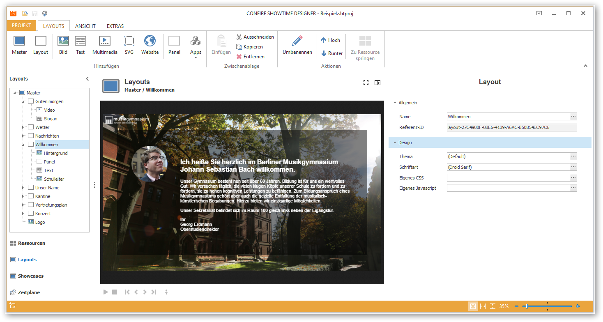

# Layouts verwalten

Mit Layouts legen Sie das Design eines späteren Showcases fest. Layouts enthalten Layout-Elemente wie Bilder, Text, SVG, Panels, Multimedia, Websites oder Apps. Diese Elemente können Sie per Drag & Drop frei positionieren und über einen Eigenschaften-Editor weiter konfigurieren.

Layouts werden hierarchisch verwaltet. Ausgangspunkt ist stets ein spezielles Layout \(Masterlayout\), das die Zielauflösung \(z.B. 1920 x 1080 Bildpunkte für Full-HD\) festlegt.

Um mit Layouts arbeiten zu können, müssen Sie in der linken Navigationsleiste des Designers auf `Layouts` klicken.

## Layouts erstellen

So erstellen Sie ein neues Masterlayout:

1. Klicken Sie auf `LAYOUTS > Masterlayout`. Ein Dialogfenster öffnet sich.

2. Vergeben Sie einen Namen für Ihr neues Masterlayout und bestätigen Sie mit `OK`.

Haben Sie mindestens ein Masterlayout erstellt, könnnen Sie weitere Layouts hinzufügen:

1. Markieren sie ein vorhandenes Layout

2. Klicken Sie auf `LAYOUTS > Layout`. Ein Dialogfenster öffnet sich.

3. Vergeben Sie einen Namen für Ihr neues Layout und bestätigen Sie mit `OK`.

## Layouts bearbeiten

Alle Eigenschaften eines Layouts können Sie auf der rechten Seite im Eigenschaften-Editor anpassen. Möchten Sie ein Layout löschen, markieren Sie es, klicken Sie auf `LAYOUTS > Entfernen` und bestätigen Sie die Sicherheitsabfrage.

## Weitere Kapitel

* [Bildelemente](images.md)
* [Textelemente](text.md)
* [Multimedia-Elemente](multimedia.md)
* [SVG-Elemente](svg.md)
* [Website-Elemente](websites.md)
* [Panel-Elemente](shapes.md)
* [RSS-Ticker-App](rss-ticker.md)
* [Uhr-App](clock.md)
* [Wetter-App](weather.md)
* [DAVINCI-App](davinci.md)

