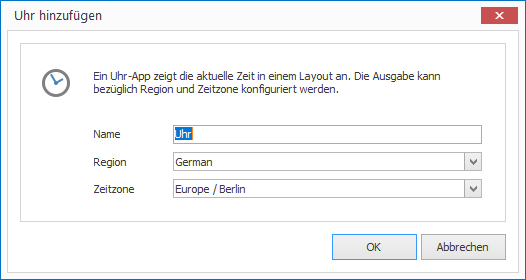

# Uhr-App

Mit der Uhr-App können die aktuelle Uhrzeit in einem Layout darstellen. Es werden auch unterschiedliche Zeitzonen unterstützt.

## Ein Uhren-Element hinzufügen

1. Klicken Sie auf `LAYOUTS > Uhr`. Ein Dialogfenster öffnet sich.

   

3. Vergeben Sie einen aussagekräftigen Namen für das neue Layout-Element.

4. Wählen Sie Region und Zeitzone aus. 

5. Bestätigen Sie mit `OK`.

Das neue Uhren-Element wird nun im aktuellen Layout dargestellt. Per Drag & Drop können Sie Größe, Positionierung und Drehung beeinflussen.

## Eigenschaften eines Uhren-Elements

Haben Sie ein Uhren-Element in einem Layout mit der Maus markiert, werden Ihnen auf der rechten Seite alle Eigenschaften des Elements angezeigt.

Neben den für alle grafischen Elemente gleichen Eigenschaften können Sie für Uhren-Elemente folgende Eigenschaften konfigurieren:

Eigenschaft       | Bedeutung
------------------| ---------
Beschriftung 1    | Freie Beschriftung (Bedeutung Template-abhängig)
Beschriftung 2    | Freie Beschriftung (Bedeutung Template-abhängig)
Region            | Region für Datums- und Zeitausgabe
Zeitzone          | Aktuelle Zeitzone für die Zeitanzeige

[RSS-Feeds]: ../../../reference/layouts/rss.md