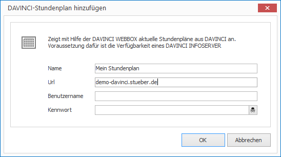
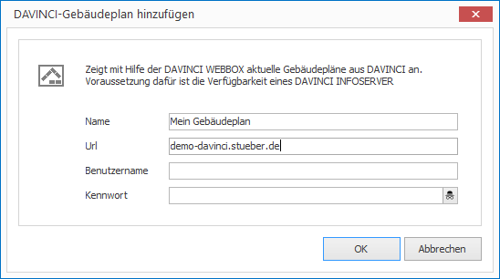

# DAVINCI-App

[DAVINCI] ist eine Software zur professionellen Stunden-, Vertretungs- und Kursplanung. 

Mit der DAVINCI-App können Sie Stundenpläne, Vertretungspläne und Gebäudepläne von einem [DAVINCI INFOSERVER] abrufen und direkt in einem Layout darstellen. Grundlage für die Darstellung ist die komplett integrierte [DAVINCI WEBBOX]-Technologie.

## Eine Vertretungsliste hinzufügen

1. Klicken Sie auf `LAYOUTS > Apps > DAVINCI > Vertretungsliste`. Ein Dialogfenster öffnet sich.

   

3. Vergeben Sie einen aussagekräftigen Namen für das neue Layout-Element.

4. Geben Sie die `URL` zu Ihrem DAVINCI INFOSERVER ein und optional auch `Benutzername` und `Kennwort`.

5. Bestätigen Sie mit `OK`.

Das neue DAVINCI-Element wird nun im aktuellen Layout dargestellt. Per Drag & Drop können Sie Größe, Positionierung und Drehung beeinflussen.

## Einen Stundenplan hinzufügen

1. Klicken Sie auf `LAYOUTS > Apps > DAVINCI > Stundenplan`. Ein Dialogfenster öffnet sich.

   

3. Vergeben Sie einen aussagekräftigen Namen für das neue Layout-Element.

4. Geben Sie die `URL` zu Ihrem DAVINCI INFOSERVER ein und optional auch `Benutzername` und `Kennwort`.

5. Bestätigen Sie mit `OK`.

Das neue DAVINCI-Element wird nun im aktuellen Layout dargestellt. Per Drag & Drop können Sie Größe, Positionierung und Drehung beeinflussen.

## Einen Gebäudeplan hinzufügen

1. Klicken Sie auf `LAYOUTS > Apps > DAVINCI > Gebäudeplan`. Ein Dialogfenster öffnet sich.

   

3. Vergeben Sie einen aussagekräftigen Namen für das neue Layout-Element.

4. Geben Sie die `URL` zu Ihrem DAVINCI INFOSERVER ein und optional auch `Benutzername` und `Kennwort`.

5. Bestätigen Sie mit `OK`.

Das neue DAVINCI-Element wird nun im aktuellen Layout dargestellt. Per Drag & Drop können Sie Größe, Positionierung und Drehung beeinflussen.

## Eigenschaften eines DAVINCI-Elements

Haben Sie ein DAVINCI-Element in einem Layout mit der Maus markiert, werden Ihnen auf der rechten Seite alle Eigenschaften des Elements angezeigt.

Neben den für alle grafischen Elemente gleichen Eigenschaften können Sie für DAVINCI-Elemente folgende Eigenschaften konfigurieren:

### Vertretungsliste

Eigenschaft         | Bedeutung
------------------- | ---------
URL                 | URL Ihres DAVINCI INFOSERVER
Benutzername        | Benutzername eines DAVINCi-Kontos
Kennwort            | Kennwort eines DAVINCi-Kontos
Datum               | Entweder `Heute` oder `Genauer Tag`
Tag                 | Tagesdatum bei Angabe `Genauer Tag`
Abweichung          | Abweichung vom Datum (positiv oder negativ)
Anzeigeformat       | Angabe, wie weit in die Zukunft geschaut werden soll
Seitenumbruch nach  | Nach wievielen Sekunden soll zur nächsten Seite gewechselt werden?
Aktualisierung nach | Nach wievielen Sekunden soll der Inhalt neu vom Server geladen werden?
Weitere Parameter   | Freie Parametereingabe (die Liste der möglichen Parameter finden Sie auf den [DAVINCI WEBBOX]-Webseiten)

### Stundenplan

Eigenschaft        | Bedeutung
------------------ | ---------
URL                | URL Ihres DAVINCI INFOSERVER
Benutzername       | Benutzername eines DAVINCi-Kontos
Kennwort           | Kennwort eines DAVINCi-Kontos
Datum              | Entweder `Heute` oder `Genauer Tag`
Tag                | Tagesdatum bei Angabe `Genauer Tag`
Zeit               | Entweder `Jetzt` oder `Genaue Uhrzeit`
Uhrzeit            | Uhrzeit bei Angabe `Genaue Uhrzeit`
Abweichung         | Abweichung von Tag und Uhrzeit (positiv oder negativ)
Spaltenüberschrift | `Datum`, `Lehrer`, `Klasse` oder `Raum`
Anzeigeformat      | `Wochenanzeige` oder `Tagesanzeige` bei Auswahl `Datum`.
Max. Überlappung   | Maximale Anzahl von parallel angezeigten Terminen in einer Zelle des Stundenplans. Andernfalls werden die Termine im Wechsel nacheinander angezeigt.
Weitere Parameter  | Freie Parametereingabe (die Liste der möglichen Parameter finden Sie auf den [DAVINCI WEBBOX]-Webseiten)

### Gebäudeplan

Eigenschaft        | Bedeutung
------------------ | ---------
URL                | URL Ihres DAVINCI INFOSERVER
Benutzername       | Benutzername eines DAVINCi-Kontos
Kennwort           | Kennwort eines DAVINCi-Kontos
Datum              | Entweder `Heute` oder `Genauer Tag`
Tag                | Tagesdatum bei Angabe `Genauer Tag`
Zeit               | Entweder `Jetzt` oder `Genaue Uhrzeit`
Uhrzeit            | Uhrzeit bei Angabe `Genaue Uhrzeit`
Abweichung         | Abweichung von Tag und Uhrzeit (positiv oder negativ)
Etage              | Welche Etage soll angezeigt werden?
Skalierung         | Skalierung der Anzeige in Prozent
Weitere Parameter  | Freie Parametereingabe (die Liste der möglichen Parameter finden Sie auf den [DAVINCI WEBBOX]-Webseiten)

[DAVINCI]: http://davinci.stueber.de
[DAVINCI INFOSERVER]: http://davinci.stueber.de/davinci-infoserver.php
[DAVINCI WEBBOX]: http://davinci-webbox.stueber.de
