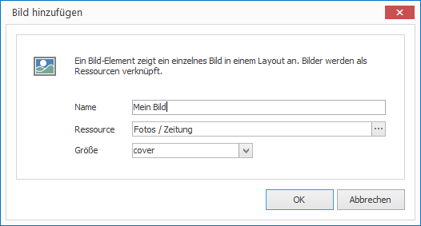

# Bildelemente

Mit Bildelementen können Sie einzelne Bilder auf einem Layout platzieren. Als Voraussetzung benötigen Sie eine Bild-Ressource. 

## Eine Bildelement hinzufügen

1. Klicken Sie auf `LAYOUTS > Bild`. Ein Dialogfenster öffnet sich.

   

3. Vergeben Sie einen aussagekräftigen Namen für das neue Layout-Element.

4. Wählen Sie eine passende Bild-Ressource aus und bestätigen Sie mit `OK`.

Das neue Bildelement wird nun im aktuellen Layout dargestellt. Per Drag & Drop können Sie Größe, Positionierung und Drehung beeinflussen.

## Eigenschaften eines Bildelements

Haben Sie ein Bildelement in einem Layout mit der Maus markiert, werden Ihnen auf der rechten Seite alle Eigenschaften des Elements angezeigt.

Neben den für alle grafischen Elemente gleichen Eigenschaften können Sie für Bildelemente folgende Eigenschaften konfigurieren:

Eigenschaft  | Bedeutung
------------ | ---------
Ressource    | Verweis auf eine Bild-Ressource
Größe        | Darstellungsgröße des Bildes. Die mögichen Werte haben ihre Entsprechung in der CSS-Eigenschaft `background-size`

