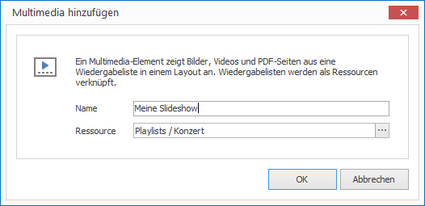

# Multimedia-Elemente

Mit Multimedia-Elementen können Sie einzelne Bilder, Bildsammlungen, Videos, Videossammlungen oder PDF-Seiten in einer Slideshow in einem Layout abspielen. Als Voraussetzung benötigen Sie eine Wiedergabeliste. 

## Eine Multimedia-Element hinzufügen

1. Klicken Sie auf `LAYOUTS > Multimedia`. Ein Dialogfenster öffnet sich.

   

3. Vergeben Sie einen aussagekräftigen Namen für das neue Layout-Element.

4. Wählen Sie eine passende Wiedergabeliste aus und bestätigen Sie mit `OK`.

Das neue Multimedia-Element wird nun im aktuellen Layout dargestellt. Per Drag & Drop können Sie Größe, Positionierung und Drehung beeinflussen.

## Eigenschaften eines Multimedia-Elements

Haben Sie ein Multimedia-Element in einem Layout mit der Maus markiert, werden Ihnen auf der rechten Seite alle Eigenschaften des Elements angezeigt.

Neben den für alle grafischen Elemente gleichen Eigenschaften können Sie für Multimedia-Elemente folgende Eigenschafgten konfigurieren:

Eigenschaft        | Bedeutung
------------------ | ---------
Ressource          | Verweis auf eine Wiedergabeliste
Lautsärke          | Lautstärke des Tons bei Videos
Stumm              | Sollen Videos ohne Ton abgespielt werden?
Endlossschleife    | Soll die Wiedergabeliste immer wieder von vorne anfangen? 
Visueller Übergang | Visueller Übergang beim Wechsel von Einträgen in der Wiedergabeliste 
Audioübergang      | Tonaler Übergang beim Wechsel von Einträgen in der Wiedergabeliste 