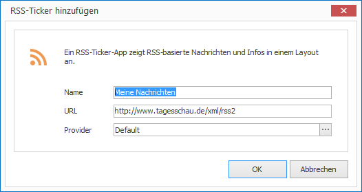

# RSS-Ticker-App

Mit der RSS-Ticker-App können Sie [RSS-Feeds] konsumieren und in einem Layout darstellen. Da RSS-Feed-Inhalte sich syntaktisch unterscheiden können, können Sie u.a. auch zwischen verschiedenen Parsern auswählen.

## Ein RSS-Ticker-Element hinzufügen

1. Klicken Sie auf `LAYOUTS > RSS-Ticker`. Ein Dialogfenster öffnet sich.

   

3. Vergeben Sie einen aussagekräftigen Namen für das neue Layout-Element.

4. Geben Sie eine URL zu einem RSS-Feed ein und wählen Sie bei Bedarf einen Provider aus. 

5. Bestätigen Sie mit `OK`.

Das neue RSS-Ticker-Element wird nun im aktuellen Layout dargestellt. Per Drag & Drop können Sie Größe, Positionierung und Drehung beeinflussen.

## Eigenschaften eines RSS-Ticker-Elements

Haben Sie ein RSS-Ticker-Element in einem Layout mit der Maus markiert, werden Ihnen auf der rechten Seite alle Eigenschaften des Elements angezeigt.

Neben den für alle grafischen Elemente gleichen Eigenschaften können Sie für RSS-Ticker-Elemente folgende Eigenschaften konfigurieren:

Eigenschaft       | Bedeutung
------------------| ---------
URL               | URL des RSS-Feeds
Provider          | RSS-Parser
Anzeigedauer      | Anzeigedauer einer Nachricht bei statischer Anzeige
Animationsgeschw. | Animationsgeschwindigkeit bei animierter Anzeige

[RSS-Feeds]: ../../../reference/layouts/rss.md