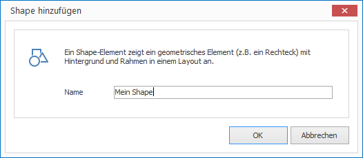

# Shape-Elemente

Mit Shape-Elementen können Sie ein geometrisches Element ohne Inhalt (z.B. ein Rechteck) auf einem Layout platzieren. 

## Eine Shape-Element hinzufügen

1. Klicken Sie auf `LAYOUTS > Shape`. Ein Dialogfenster öffnet sich.

   

3. Vergeben Sie einen aussagekräftigen Namen für das neue Layout-Element und bestätigen Sie mit `OK`.

Das neue Shape-Element wird nun im aktuellen Layout dargestellt. Per Drag & Drop können Sie Größe, Positionierung und Drehung beeinflussen.

## Eigenschaften eines Shape-Elements

Haben Sie ein Shape-Element in einem Layout mit der Maus markiert, werden Ihnen auf der rechten Seite alle Eigenschaften des Elements angezeigt. 

Neben den für alle grafischen Elemente gleichen Eigenschaften besitzt ein Shape-Element keine weiteren speziellen Eigenschaften.
