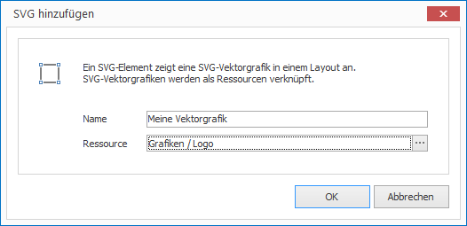

# SVG-Elemente

Mit SVG-Elementen können Sie Vekrografiken auf einem Layout platzieren. Als Voraussetzung benötigen Sie eine SVG-Ressource. 

## Eine SVG-Element hinzufügen

1. Klicken Sie auf `LAYOUTS > SVG`. Ein Dialogfenster öffnet sich.

   

3. Vergeben Sie einen aussagekräftigen Namen für das neue Layout-Element.

4. Wählen Sie eine passende SVG-Ressource aus und bestätigen Sie mit `OK`.

Das neue SVG-Element wird nun im aktuellen Layout dargestellt. Per Drag & Drop können Sie Größe, Positionierung und Drehung beeinflussen.

## Eigenschaften eines SVG-Elements

Haben Sie ein SVG-Element in einem Layout mit der Maus markiert, werden Ihnen auf der rechten Seite alle Eigenschaften des Elements angezeigt.

Neben den für alle grafischen Elemente gleichen Eigenschaften können Sie für SVG-Elemente folgende Eigenschaften konfigurieren:

Eigenschaft  | Bedeutung
------------ | ---------
Ressource    | Verweis auf eine SVG-Ressource

