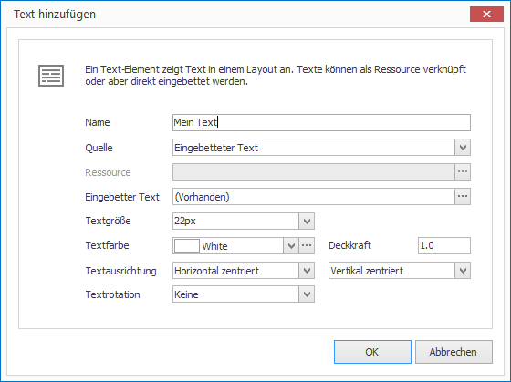

# Textelemente

Mit Text-Elementen können Sie Texte in einem Layout darstellen. Texte können direkt eingetippt werden oder als Text-Ressource verknüpft werden. Der Texteditor in CONFIRE SHOWTIME unterstützt [Markdown].

## Eine Textlement hinzufügen

1. Klicken Sie auf `LAYOUTS > Text`. Ein Dialogfenster öffnet sich.

   

3. Vergeben Sie einen aussagekräftigen Namen für das neue Layout-Element.

4. Wählen Sie als `Quelle` entweder `Ressource` oder `Eingebetteter Text` aus.

   1. Bei `Ressource` müssen Sie im nächsten Schritt eine Text-Ressource auswählen.
   2. Bei `Eingebetteter Text` können Sie im nächsten Schritt einen Text eintippen.

6.  Ändern Sie je nach Bedarf weitere Eigenschaften ab und bestätigen Sie mit `OK`.

Das neue Textlement wird nun im aktuellen Layout dargestellt. Per Drag & Drop können Sie Größe, Positionierung und Drehung beeinflussen.

## Eigenschaften eines Textlements

Haben Sie ein Textlement in einem Layout mit der Maus markiert, werden Ihnen auf der rechten Seite alle Eigenschaften des Elements angezeigt.

Neben den für alle grafischen Elemente gleichen Eigenschaften können Sie für Textlemente folgende Eigenschaften konfigurieren:

Eigenschaft        | Bedeutung
------------------ | ---------
Quelle             | Text-Ressource oder Text direkt eintippen?
Ressource          | Verweis auf eine Text-Ressource
Eingebetteter Text | Texteditor
Textgröße          | Schriftgröße des Textes
Textfarbe          | Schriftfarbe des Textes.
Textausrichtung    | Horizontale und vertikale Ausrichtung des Textes
Textrotation       | Textrotation
Innere Abstände    | Die Abständes des Textes zum Rand des Elements.

[Markdown]: ../../../reference/layouts/markdown.md