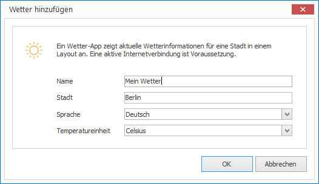

# Wetter-App

Mit der Wetter-App können Sie aktuelle Wetterinformationen für eine vorgegebene Stadt in einem Layout darstellen.

## Ein Wetter-Element hinzufügen

1. Klicken Sie auf `LAYOUTS > Wetter`. Ein Dialogfenster öffnet sich.

   

3. Vergeben Sie einen aussagekräftigen Namen für das neue Layout-Element.

4. Geben Sie den Namen der Stadt ein, für welche Sie die Wetterinformationen anzeigen möchten. 

5. Wählen Sie Sprache und Temperatureinheit aus. 

6. Bestätigen Sie mit `OK`.

Das neue Wetter-Element wird nun im aktuellen Layout dargestellt. Per Drag & Drop können Sie Größe, Positionierung und Drehung beeinflussen.

## Eigenschaften eines Wetter-Elements

Haben Sie ein Wetter-Element in einem Layout mit der Maus markiert, werden Ihnen auf der rechten Seite alle Eigenschaften des Elements angezeigt.

Neben den für alle grafischen Elemente gleichen Eigenschaften können Sie für Wetter-Elemente folgende Eigenschaften konfigurieren:

Eigenschaft       | Bedeutung
------------------| ---------
Stadt             | Stadt, für welche die Wetterinfos angezeigt werden sollen
Sprache           | Sprache der Informationen
Temperatureinheit | Celsius oder Fahrenheit

[RSS-Feeds]: ../../../reference/layouts/rss.md