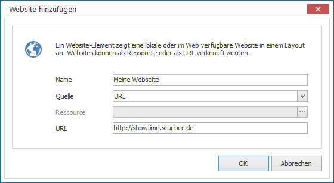

# Website-Elemente

Mit Website-Elementen können Sie selbst erstellte HTML-Seiten oder aber Live-Webseiten aus dem Internet in einem Layout anzeigen. 

## Eine Website-Element hinzufügen

1. Klicken Sie auf `LAYOUTS > Website`. Ein Dialogfenster öffnet sich.

   

3. Vergeben Sie einen aussagekräftigen Namen für das neue Layout-Element.

4. Wählen Sie als `Quelle` entweder `Ressource` oder `URL` aus.

   1. Bei `Ressource` müssen Sie im nächsten Schritt eine HTML-Ressource auswählen.
   2. Bei `URL` können Sie im nächsten Schritt eine URL eintippen.

5.  Ändern Sie je nach Bedarf weitere Eigenschaften ab und bestätigen Sie mit `OK`.

Das neue Website-Element wird nun im aktuellen Layout dargestellt. Per Drag & Drop können Sie Größe, Positionierung und Drehung beeinflussen.

## Eigenschaften eines Website-Elements

Haben Sie ein Website-Element in einem Layout mit der Maus markiert, werden Ihnen auf der rechten Seite alle Eigenschaften des Elements angezeigt.

Neben den für alle grafischen Elemente gleichen Eigenschaften können Sie für Website-Elemente folgende Eigenschaften konfigurieren:

Eigenschaft              | Bedeutung
------------------------ | ---------
Quelle                   | HTML-Ressource oder URL direkt eintippen?
Ressource                | Verweis auf eine HTML-Ressource
URL                      | URL zu einer Webseite
Aktualisierung           | Art der automatischen Inhaltsaktualisierung
Aktualisierungsintervall | Aktualisierungsintervall
Skalierung               | Skalierung der Webseite
Interaktiv               | Ist Interaktivtät (z.B. Klciken auf Verweise) erlaubt?
Laufbalken verbergen     | Soll der Laufbalken bei übergroßem Inhalt verborgen werden?