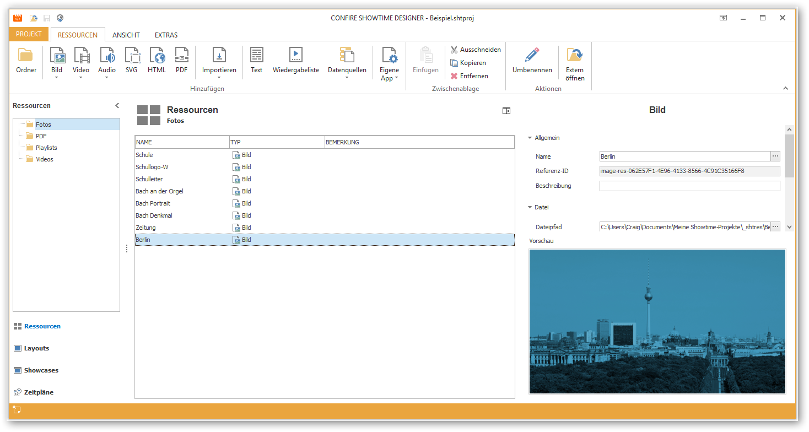

# Ressourcen verwalten

Ressourcen bilden das Rückgrat eines Projektes. Möchten Sie Bilder, Videos, Grafiken, PDF etc. anzeigen, so werden diese Mediendateien als Ressourcen abgelegt. Diese Entkopplung vom Layout erlaubt es, ein und dieselbe Ressource mehrfach zu verwenden. So können Sie beispielsweise zwei Layouts im Querformat und im Hochformat erstellen, die beide die exakt gleichen Ressourcen verwenden. Tauschen Sie nachträglich eine Ressource (z.B. ein Foto) aus, so wird sie automatisch in allen Layouts, die auf diese Ressource verweisen, aktualisiert. Das kann gerade bei großen Projekten sehr viel Zeit sparen.

Ressourcen werden in einer hierarchischen Ordnerstruktur verwaltet. Sie können Ressourcen zwischen Ordnern per Drag & Drop hin- und herschieben. Visuelle Ressourcen (Bilder, Videos, Grafiken, PDFs, etc.) werden in einer integrierten Vorschau angezeigt.

Um mit Ressourcen arbeiten zu können, müssen Sie in der linken Navigationsleiste des Designers auf `Ressourcen` klicken.

## Ordner erstellen

So erstellen Sie einen neuen Ressourcen-Ordner:

1. Klicken Sie auf `RESSOURCEN > Ordner`. Ein Dialogfenster öffnet sich.

2. Vergeben Sie einen Namen für Ihren neuen Ordner und bestätigen Sie mit `OK`.

## Ordner bearbeiten

Ein Ordner hat als einzige Eigscnafte seinen Namen. Den können Sie über `RESSOURCEN > Umbenennen` ändern. Möchten Sie einen Ordner löschen, markieren Sie ihn, klicken Sie auf `RESSOURCEN > Entfernen` und bestätigen Sie die Sicherheitsabfrage.

> #### warning::Achtung
> 
> Das Löschen eines Ordners hat zur Folge, dass auch alle Unterordner und alle enthaltenen Ressourcen gelöscht werden.

## Weitere Kapitel

* [Bilder verwalten](images.md)
* [Videos verwalten](videos.md)
* [Audios verwalten](audios.md)
* [SVG verwalten](svg.md)
* [PDF verwalten](pdf.md)
* [HTML verwalten](html.md)
* [Texte verwalten](text.md)
* [Wiedergabelisten verwalten](playlists.md) 