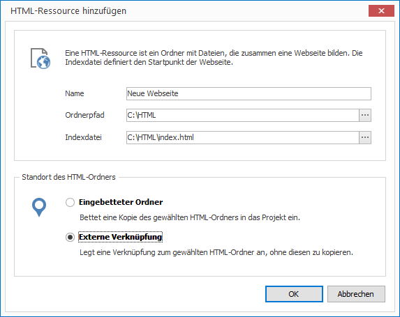

# HTML verwalten

Möchten Sie HTML-Dateien in Ihrem Projekt nutzen, können Sie einen Ordner mit allen notwendigen Dateien (HTML, CSS, Javascript, Bilder, etc.) importieren.

## Eine HTML-Ressource importieren

1. Klicken Sie auf `RESSOURCEN > HTML`. Ein Dialogfenster zur Ordnerauswahl öffnet sich.

2. Wählen Sie den gewünschten Ordner aus und bestätiogen Sie mit `OK`. Ein weiteres Dialogfenster öffnet sich.
   
   

3. Vergeben Sie einen aussagekräftigen Namen für Ihre neue Ressource. 

4. Geben Sie eine HTML-Indexdatei an. Dies ist die Startdatei, die später in einem Layout aufgerufen wird. 

4. Wählen Sie, ob Sie Ihre HTML-Dateien als eingebettete Datei oder als externe Verknüpfung einfügen möchten. Im ersten Fall wird die Datei kopiert und ist vortan Teil des Projekt (eingebettete Ressource). Im zweiten Fall wird lediglich der Dateipfad gespeichert (externe Ressource).

5. Bestätigen Sie mit `OK`.
