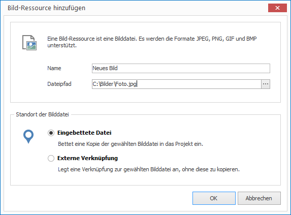
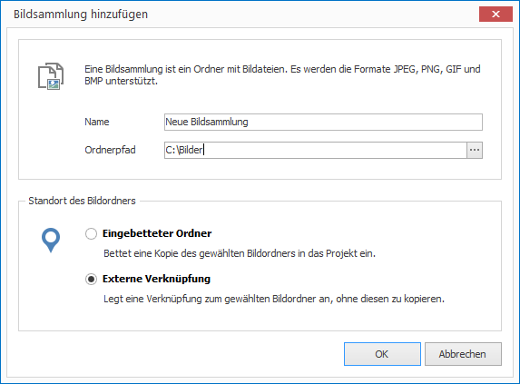

# Bilder verwalten

Möchten Sie Bilder (z.B. Fotos) in Ihrem Projekt hinterlegen, müssen Sie sich zunächst entscheiden, ob Sie eine einzelne Bilddatei oder gleich einen ganzen Ordner voller Bilder (Bildsammlung) importieren möchten.

Eine Bildsammlung dient dazu, eine größere Menge von Bildern als Slideshow abspielen zu können, während einzelne Bilder auch als Element in einem Layout plaziert werden können.

## Eine Bilddatei importieren

1. Klicken Sie auf `RESSOURCEN > Bild > Bilddatei`. Ein Dialogfenster zur Dateiauswahl öffnet sich.

2. Wählen Sie die gewünschte Datei aus und bestätiogen Sie mit `Öffnen`. Ein weiteres Dialogfenster öffnet sich.
   
   

3. Vergeben Sie einen aussagekräftigen Namen für Ihre neue Ressource. 

4. Wählen Sie, ob Sie Ihre Bilddatei als eingebettete Datei oder als externe Verknüpfung einfügen möchten. Im ersten Fall wird die Datei kopiert und ist vortan Teil des Projekt (eingebettete Ressource). Im zweiten Fall wird lediglich der Dateipfad gespeichert (externe Ressource).

5. Bestätigen Sie mit `OK`.

## Eine Bildsammlung importieren

1. Klicken Sie auf `RESSOURCEN > Bild > Bildsammlung`. Ein Dialogfenster zur Ordnerauswahl öffnet sich.

2. Wählen Sie den gewünschten Ordner aus und bestätigen Sie mit `OK`. Ein weiteres Dialogfenster öffnet sich.
   
   

3. Vergeben Sie einen aussagekräftigen Namen für Ihre neue Ressource. 

4. Wählen Sie, ob Sie Ihre Bilddatei als eingebettete Datei oder als externe Verknüpfung einfügen möchten. Im ersten Fall wird die Datei kopiert und ist fortan Teil des Projekt (eingebettete Ressource). Im zweiten Fall wird lediglich der Dateipfad gespeichert (externe Ressource).

5. Bestätigen Sie mit `OK`.

