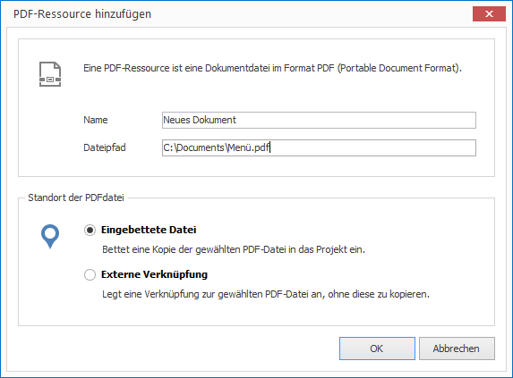

# PDF verwalten

PDF (Portable Document Format) ist ein plattformunabhängiges Dateiformat für Dokumente. Es kann von anderen Anwendungen (z.B. Office) generiert werden. 

## Eine PDF-Datei importieren

1. Klicken Sie auf `RESSOURCEN > PDF`. Ein Dialogfenster zur Dateiauswahl öffnet sich.

2. Wählen Sie die gewünschte Datei aus und bestätiogen Sie mit `Öffnen`. Ein weiteres Dialogfenster öffnet sich.
   
   

3. Vergeben Sie einen aussagekräftigen Namen für Ihre neue Ressource. 

4. Wählen Sie, ob Sie Ihre PDF-Datei als eingebettete Datei oder als externe Verknüpfung einfügen möchten. Im ersten Fall wird die Datei kopiert und ist vortan Teil des Projekt (eingebettete Ressource). Im zweiten Fall wird lediglich der Dateipfad gespeichert (externe Ressource).

5. Bestätigen Sie mit `OK`.

## PDF-Dokumente erstellen

Alle modernen Office-Anwendungen (WinWord, Excel, Powerpoint und Ihre Äquivalente in OpenOffice, LibreOffice etc.) besitzen eine PDF-Export-Funktion, mit der ein Dokument, eine Arbeitsmappe oder eine Präsentation ins PDF-Format konvertiert werden kann.

Haben Sie Microsoft Office oder Open Office auf dem gleichen Comptuer installiert, wie CONFIRE SHOWTIME, könnne Sie derartige Dokumente direkt nach CONFIRE SHOWTIME importieren:

1. Klicken Sie auf `RESSOURCEN > Importieren`. 

2. Klicken Sie auf das gewünschte Ausgangsformat. Sie können zwischen WinWord, Powerpoint, OpenOFfice Writer und OpenOffice Impress wählen. Ein Dialogfenster zur Dateiauswahl öffnet sich. 

3. Wählen Sie die gewünschte Datei aus und bestätiogen Sie mit `Öffnen`.
   

