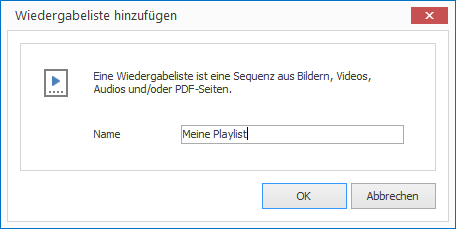
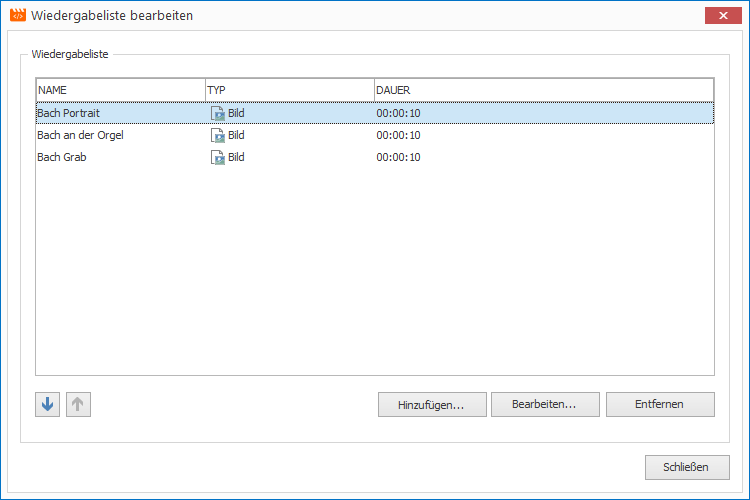

# Wiedergabelisten verwalten

Wiedergabelisten definieren eine Sequenz von Bilder, Videos, Audios oder PDF-Seiten. Sie werden in Layouts benötigt, um Multimedia-Elemente mit Inhalt zu versorgen.

## Eine Wiedergabeliste erstellen

1. Klicken Sie auf `RESSOURCEN > Wiedergabeliste`. Ein Dialogfenster öffnet sich.
   
   

2. Vergeben Sie einen aussagekräftigen Namen für Ihre neue Ressource und bestätigen Sie mit `OK`.

3. Doppelcklicken Sie auf die neu erstellte Wiedergabeliste in der aktuellen Ressourcen-Liste. Ein Dialogfenster öffnet sich.
   
   

5. Fügen Sie neue Einträge hinzu, bearbeiten Sie bestehende oder löschen Sie welche.

