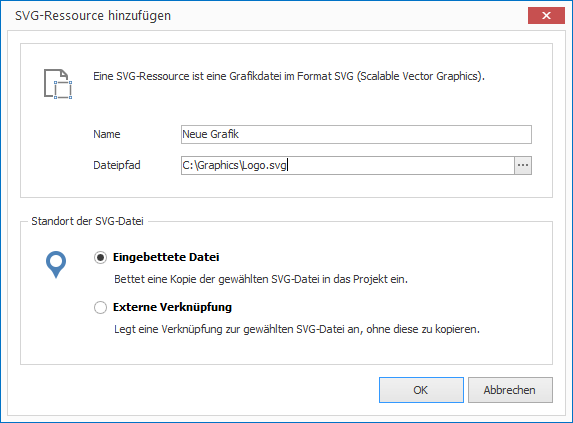

# SVG verwalten

SVG-Grafiken erlauben das Einbinden von Vektorgrafiken. SVG (Scalable Vector Graphics) ist die vom World Wide Web Consortium (W3C) empfohlene Spezifikation zur Beschreibung zweidimensionaler Vektorgrafiken. 

## Eine SVG-Datei importieren

1. Klicken Sie auf `RESSOURCEN > SVG`. Ein Dialogfenster zur Dateiauswahl öffnet sich.

2. Wählen Sie die gewünschte Datei aus und bestätiogen Sie mit `Öffnen`. Ein weiteres Dialogfenster öffnet sich.
   
   

3. Vergeben Sie einen aussagekräftigen Namen für Ihre neue Ressource. 

4. Wählen Sie, ob Sie Ihre SVG-Datei als eingebettete Datei oder als externe Verknüpfung einfügen möchten. Im ersten Fall wird die Datei kopiert und ist vortan Teil des Projekt (eingebettete Ressource). Im zweiten Fall wird lediglich der Dateipfad gespeichert (externe Ressource).

5. Bestätigen Sie mit `OK`.

