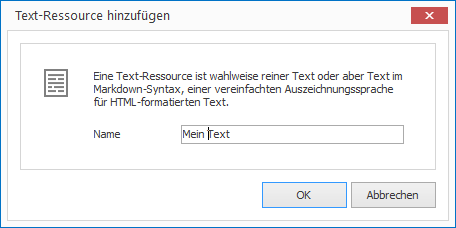
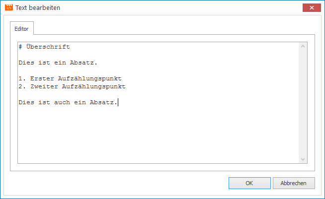

# Texte verwalten

Möchten Sie Texte mehrfach im Projekt nutzen, macht es Sinn diese als Text-Ressource zu hinterlegen. Texte können wahlweise aus einfachem Text oder formatiertem Text bestehen. Formatierter Text basiert auf [Markdown], einer sehr einfachen und intuitiven Auszeichnungssprache.

## Eine Text-Ressource erstellen

1. Klicken Sie auf `RESSOURCEN > Text`. Ein Dialogfenster zur Dateiauswahl öffnet sich.
   
   

2. Vergeben Sie einen aussagekräftigen Namen für Ihre neue Ressource und bestätigen Sie mit `OK`.

3. Doppelcklicken Sie auf die neu erstellte Text-Ressource in der aktuellen Ressourcen-Liste. Ein Text-Editor öffnet sich.
   
   

5. Tippen Sie Ihren Text ein und bestätigen Sie mit `OK`.

[Markdown]: ../../../reference/layouts/markdown.md
