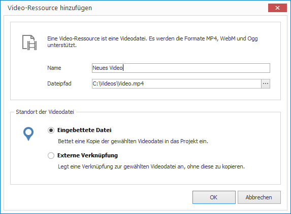
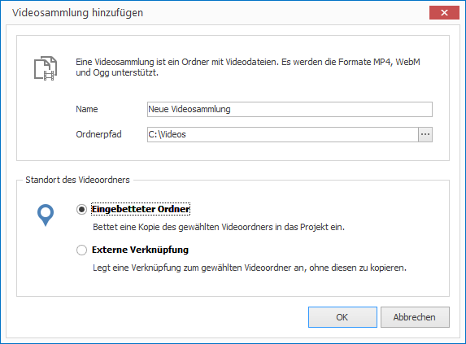

# Videos verwalten

Möchten Sie Videos in Ihrem Projekt nutzen, müssen Sie sich zunächst entscheiden, ob Sie eine einzelne Videodatei oder gleich einen ganzen Ordner voller Videos (Videosammlung) importieren möchten.

Eine Videosammlung dient dazu, eine größere Menge von Videos hintereinander abspielen zu können.

## Eine Videodatei importieren

1. Klicken Sie auf `RESSOURCEN > Video > Videodatei`. Ein Dialogfenster zur Dateiauswahl öffnet sich.

2. Wählen Sie die gewünschte Datei aus und bestätiogen Sie mit `Öffnen`. Ein weiteres Dialogfenster öffnet sich.
   
   

3. Vergeben Sie einen aussagekräftigen Namen für Ihre neue Ressource. 

4. Wählen Sie, ob Sie Ihre Videodatei als eingebettete Datei oder als externe Verknüpfung einfügen möchten. Im ersten Fall wird die Datei kopiert und ist vortan Teil des Projekt (eingebettete Ressource). Im zweiten Fall wird lediglich der Dateipfad gespeichert (externe Ressource).

5. Bestätigen Sie mit `OK`.

## Eine Videosammlung importieren

1. Klicken Sie auf `RESSOURCEN > Video > Videosammlung`. Ein Dialogfenster zur Ordnerauswahl öffnet sich.

2. Wählen Sie den gewünschten Ordner aus und bestätigen Sie mit `OK`. Ein weiteres Dialogfenster öffnet sich.
   
   

3. Vergeben Sie einen aussagekräftigen Namen für Ihre neue Ressource. 

4. Wählen Sie, ob Sie Ihre Videodatei als eingebettete Datei oder als externe Verknüpfung einfügen möchten. Im ersten Fall wird die Datei kopiert und ist fortan Teil des Projekt (eingebettete Ressource). Im zweiten Fall wird lediglich der Dateipfad gespeichert (externe Ressource).

5. Bestätigen Sie mit `OK`.

