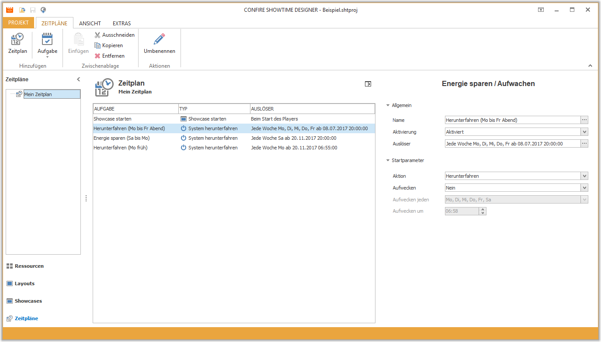

# Zeitpläne verwalten

Ein Zeitplan erlauben es, automatisch zwischen verschiedenen Showcases zu wechseln. Optional kann das System zu einem bestimmten Zeitpunkt komplett [heruntergefahren](shutdown-system.md) werden. Der Zeitplan enthält eine Liste von Aufgaben, deren Ausführung durch ein Ereignis (Start des Players oder ein bestimmter Zeitpunkt) bestimmt wird.

Um mit Zeitplänen arbeiten zu können, müssen Sie in der linken Navigationsleiste des Designers auf `Zeitpläne` klicken.

## Zeitplan erstellen

So erstellen Sie einen neuen Zeitplan:

1. Klicken Sie auf `ZEITPLÄNE > Zeitplan`. Ein Dialogfenster öffnet sich.

2. Vergeben Sie einen Namen für Ihren neuen Ordner und bestätigen Sie mit `OK`.

## Zeitpläne bearbeiten

Ein Zeitplan hat als einzige Eigenschaft seinen Namen. Den können Sie über `ZEITPLÄNE > Umbenennen` ändern. Möchten Sie einen Zeitplan löschen, markieren Sie ihn, klicken Sie auf `ZEITPLÄNE > Entfernen` und bestätigen Sie die Sicherheitsabfrage.

> #### warning::Achtung
> 
> Das Löschen eines Zeitplans hat zur Folge, dass auch alle Unterzeitpläne und alle enthaltenen Aufgaben gelöscht werden.

## Weitere Kapitel

* [Die Aufgabe "Showcase starten"](start-showcase.md)
* [Aufgaben auslösen](triggers.md)
* [Die Aufgabe "System herunterfahren"](shutdown-system.md)

