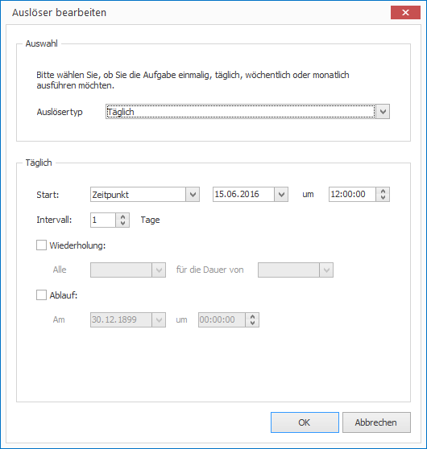

# Aufgaben auslösen

Das Ausführen von Aufgaben geschieht ereignisgesteuert. Es existieren zwei Arten von Ereignissen:

1. Der Start des Zeitplans
2. Das Erreichen eines bestimmten Zeitpunktes in der Zukunft

So konfigurieren Sie einen Auslöser:

1. Wählen Sie die gewünschte Aufgabe aus.

2. Klicken Sie im rechten Eigenschaftseditor auf die Schaltfläche mit den drei Punkten bei `Auslöser`. Ein Dialogfenster öffnet sich.
   
   

3. Wählen Sie den gewünschten Auslösertyp (einmalig, täglich, wöchentlich oder monatlich) und konfigurieren Sie die weiteren Parameter.

4. Bestätigen Sie mit `OK`.
