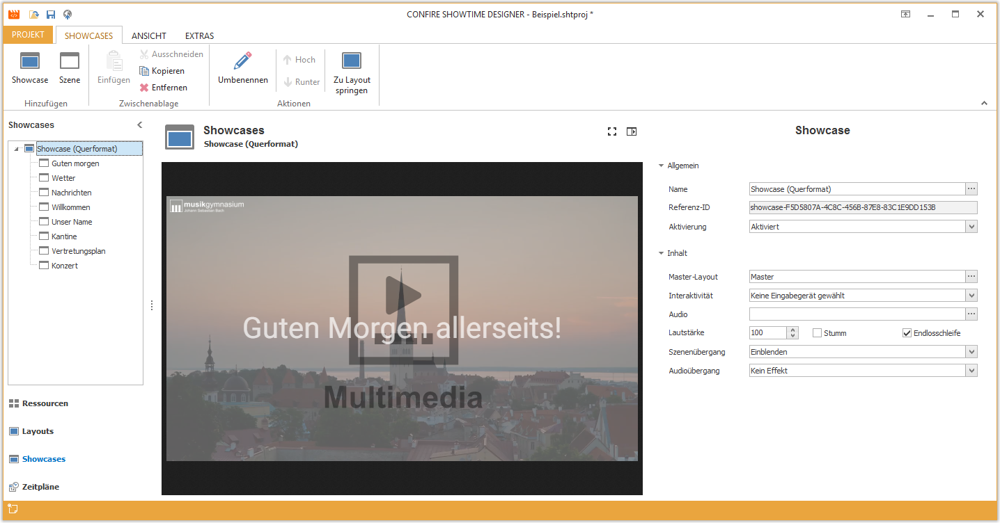

# Showcases verwalten

Showcases definieren den zeitlichen Ablauf von Layouts. Dafür erstellen Sie innerhalb eines Showcases eine Sequenz von Szenen. Für jede Szene weisen Sie genau ein Layout zu und legen die Spieldauer fest.

Sie können beliebig viele Showcases erstellen. Jedem Showcase wird genau ein Masterlayout zugewiesen. Die Szenen eines Showcases können nur Layouts unterhalb dieses Masterlayouts wählen.

Um mit Showcases und Szenen arbeiten zu können, müssen Sie in der linken Navigationsleiste des Designers auf `Showcases` klicken.

## Weitere Kapitel

* [Showcases](showcases.md)
* [Szenen](scenes.md)

