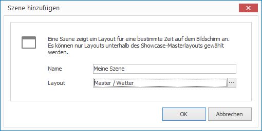

# Szenen

Szenen sind Teil einer Sequenz, die zu einem Showcase gehören. Jede Szene ist mit einem Layout verknüpft und definiert, wie lange dieses Layout angezeigt werden soll.

## Szene erstellen

So erstellen Sie einen neuen Szene:

1. Wählen Sie ein Masterlayout aus. 

1. Klicken Sie auf `SHOWCASES > Szene`. Ein Dialogfenster öffnet sich.

   
   
2. Vergeben Sie einen Namen für Ihren neue Szene und wählen Sie ein Layout aus.

3. Bestätigen Sie mit `OK`.

## Eigenschaften einer Szene

Alle Eigenschaften einer Szene können Sie auf der rechten Seite im Eigenschaften-Editor anpassen:

Eigenschaft        | Bedeutung
------------------ | ---------
Layout             | Verweis auf ein Layout
Zeitrahmen         | Interaktivität 
Dauer              | Texteditor
Audio              | Texteditor
Lautstärke         | Lautstärke des Tons bei Videos
Stunm              | Schriftfarbe des Textes.
Endlosschleife     | Horizontale und vertikale Ausrichtung des Textes
