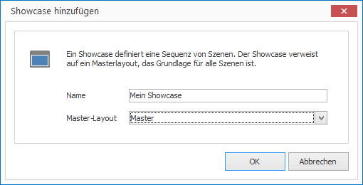

# Showcases

Showcases definieren den zeitlichen Ablauf von Layouts. Anders ausgedrückt: Ein Showcase präsentiert eine Sequenz von Layouts für eine bestimmte Bildschirmauflösung. Die Bildschirmauflösung wird durch ein Masterlayout festgelegt.

## Showcase erstellen

So erstellen Sie einen neuen Showcase:

1. Klicken Sie auf `SHOWCASES > Showcase`. Ein Dialogfenster öffnet sich.

   

2. Vergeben Sie einen Namen für Ihren neuen Showcase und wählen Sie ein Masterlayout aus.

3. Bestätigen Sie mit `OK`.

## Eigenschaften eines Showcases

Alle Eigenschaften eines Showcases können Sie auf der rechten Seite im Eigenschaften-Editor anpassen:

Eigenschaft        | Bedeutung
------------------ | ---------
Masterlayout       | Verweis auf ein Masterlayout
Interaktivität     | Interaktivität 
Audio              | Texteditor
Lautstärke         | Lautstärke des Tons bei Videos
Stunm              | Schriftfarbe des Textes.
Endlosschleife     | Horizontale und vertikale Ausrichtung des Textes
Szenenübergang     | Textrotation
Audioübergang      | Die Abständes des Textes zum Rand des Elements.
