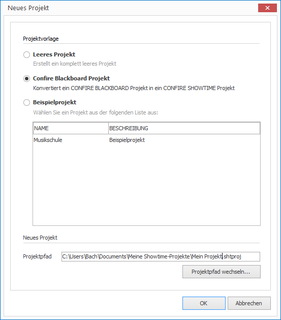

# CONFIRE BLACKBOARD-Projekte konvertieren

CONFIRE BLACKBOARD ist die Vorgängerversion zu CONFIRE SHOWTIME. Da CONFIRE SHOWTIME eine komplette Neuentwicklung ist, können Projekte aus CONFIRE BLACKBOARD nicht einfach geöffnet werden, sondern müssen konvertiert werden:

1. Klicken Sie auf `PROJEKT > Neu`. Ein Dialogfenster öffnet sich.
   
   

2. Wählen Sie die Option `Confire Blackboard Projekt`.

3. Klicken Sie auf `OK`. Ein Dialogfenster zur Dateiauswahl öffnet sich.

4. Wählen Sie das gewünschte Blackboard-Projekt aus und bestätigen Sie mit `Öffnen`.

Es wird nun ein neues CONFIRE SHOWTIME-Projekt angelegt, das alle Ressourcen und Layouts aus dem bisherigen Blackboard-Projekt enthält.

Bitte beachten Sie die folgenden Besonderheiten beim Import:

* Nicht unterstützte Videoformate wie z.B. WMV müssen durch Web-Formate wie z.B. MP4 oder WebM ersetzt werden.

* News-Ticker werden als RSS-Ticker konvertiert. Das bedeutet, Sie müssen die Inhalte der Textdateien anpassen. Statt reinem Text setzt CONFIRE SHOWTIME nun RSS-Feeds als Syntax voraus. Eine Anleitung zum Formatieren von RSS-Feeds finden Sie im Kapitel [RSS nutzen].

* Flash-Inhalte werden ignoriert, da Flash von CONFIRE SHOWTIME nicht unterstützt wird.

> #### primary::Hinweis
> In CONFIRE BLACKBOARD gibt es keine Entsprechung zu Showcases, daher müssen Sie das neu erstellte Projekt noch vervollständigen, indem Sie Showcases und bei Bedarf auch Zeitpläne erstellen.  

[RSS nutzen]: ../../../reference/layouts/rss.md