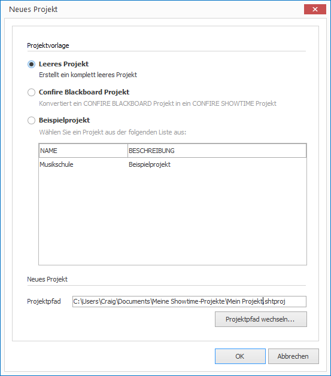

# Ein leeres Projekt 

Möchsten Sie ein neues, leeres Projekt anlegen, gehen Sie wie folgt vor:

1. Klicken Sie auf `PROJEKT > Neu`. Ein Dialogfenster öffnet sich.
   
   

2. Wählen Sie die Option `Leeres Projekt` und bestätigen Sie mit `OK`.
