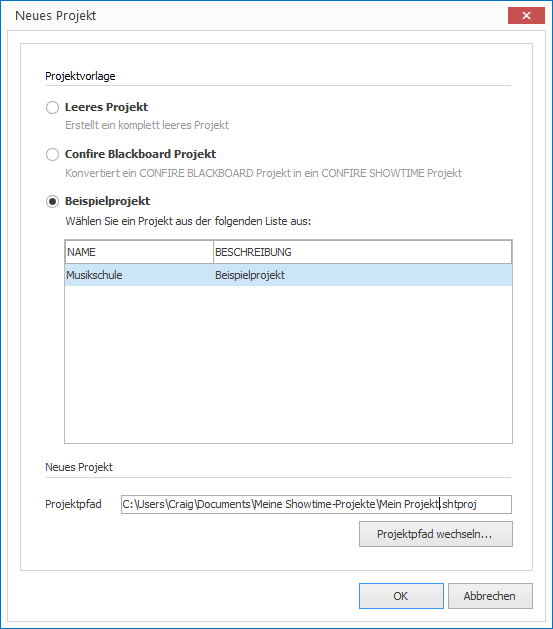

# Beispielprojekte 

Im Lieferumfang von CONFIRE SHOWTIME sind bereits Beispielprojekte enthalten, die als Vorlage für eigene Projekte dienen können:

1. Klicken Sie auf `PROJEKT > Neu`. Ein Dialogfenster öffnet sich.
   
   

2. Wählen Sie die Option `Beispielprojekt`.

3. Markieren Sie das gewünschte Beispielprojekt und bestätigen Sie mit `OK`.

Es wird nun ein neues CONFIRE SHOWTIME-Projekt angelegt, das den Inhalt der Beispielvorlage enthält. Sie können das Projekt nach Belieben ausprobieren und abändern.
