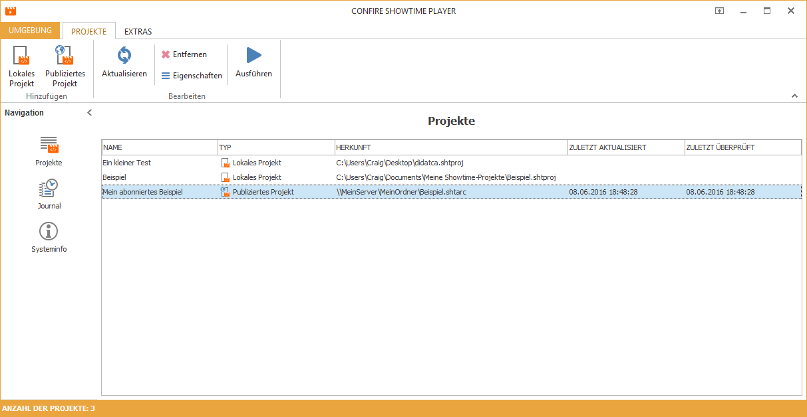

# Projekte präsentieren

Mit dem CONFIRE SHOWTIME DESIGNER erstellen oder bearbeitet Sie Projekte. Mit dem CONFIRE SHOWTIME PLAYER präsentieren Sie diese Projekte.

## Weitere Kapitel

* [Projekte abonnieren](subscribed-projects.md)
* [Projekte lokal hinzufügen](local-projects.md)
* [Projekte ausführen](start-player.md)

 
