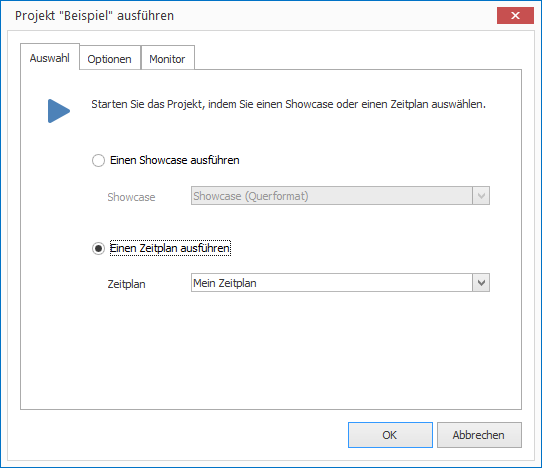
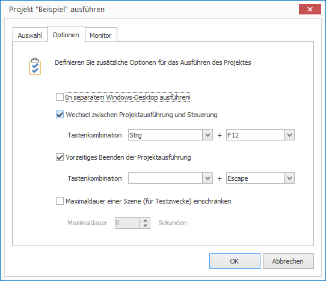
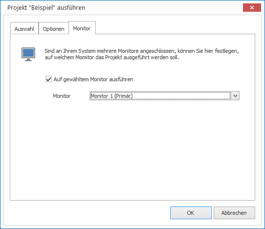

# Projekte im Player starten

Um ein Projekt im CONFIRE SHOWTIME PLAYER zu starten, müssen Sie es entweder abonniert oder lokal geladen haben. Sie können beliebig viele lokale und abonnierte Projekte im CONFIRE SHOWTIME PLAYER verwalten. Möchten Sie ein Projekt starten, gehen Sie wie folgt vor:

1. Klicken Sie in der linken Navigationsleiste auf `Projekte`, falls Sie die Ansicht `Projekt` nicht sehen. 

2. Markieren Sie nun das gewünschte Projekt und klicken Sie auf `Starten`. Ein Dialogfenster öffnet sich.

3. Sie müssen sich nun entscheiden:
   
   

   * Möchten Sie einen einzelnen Showcase starten, markieren Sie die Option `Einen Showcase ausführen` und wählen Sie anschließend den gewünschten Showcase aus.

   * Möchten Sie einen Zeitplan starten, markieren Sie die Option `Einen Zeitplan ausführen` und wählen Sie anschließend den gewünschten Zeitplan aus.

4. Auf der Registerkarte `Optionen` können Sie bei Bedarf folgende Einstellungen wählen:
   
   

   * Die Option `Auf separatem Desktop ausführen` erlaubt es, die Ausführung des Players auf einem separaten Windows-Desktop auszuführen. Der Vorteil dabei ist, dass nur der Player als Anwendung sichtbar ist. Es erscheinen beispielsweise keine störenden Meldungsfenster (z.B. E-Mail-Eingang) von gleichzeitig laufenden Anwendungen.

   * Sie können sowohl für den Wechsel zwischen Projektausführung und Playersteuerung als auch für die Beendigung der Projektausführung jeweils eine Tastenkombination festlegen. Die Standardtastenkombination für die Beendigung eines Projekts ist beispielweise `Esc`.

   * Die letzte Option erlaubt die Limitierung der Szenendauer auf eine bestimmte Zeitspanne (z.B. 10 Sekunden). Das erlaubt einen Schnelldurchlauf aller Szenen eines Showcases zu Testzwecken.

5. Auf der Registerkarte `Monitor` können Sie bei Bedarf folgende Einstellungen wählen:

   

   * Sind an Ihrem Computer zwei oder mehr Monitore angeschlossen, können Sie kontrollieren, auf welchem Monitor der Player abspielen soll. Markieren Sie dazu die Option `Auf gewähltem Monitor ausführen` und wählen Sie anschließend den gewünschten Monitor aus. 

6. Bestätigen Sie mit OK, damit der Player das Projekt ausführt.
