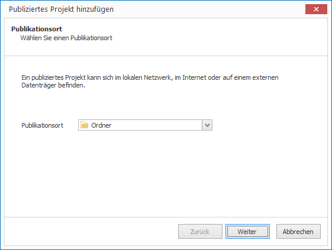
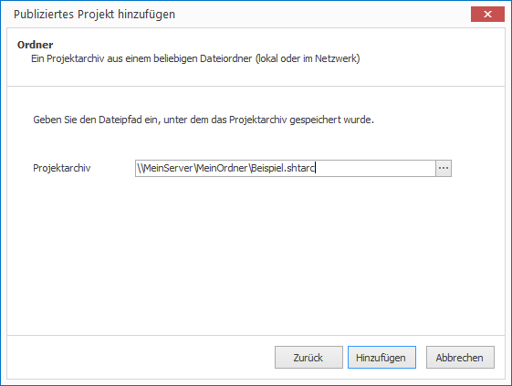
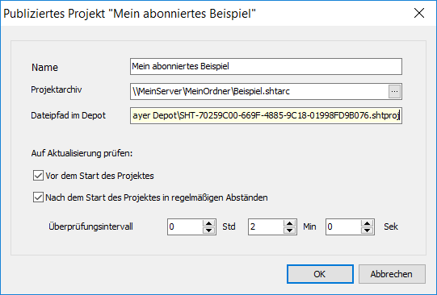

   # Projekte abonnieren

Das Abonnieren von Projekten erlaubt es dem Player, selbstständig auf Änderungen zu reagieren. Wird ein aktualisiertes Projekt erkannt, wird es bei Bedarf heruntergeladen, entpackt und das laufende Projekt wird gewechselt.

Ausführliche Informationen zum Publizieren von Projekten finden Sie im Kapitel [Projekte publizieren](../publish-projects/README.md)

So abonnieren Sie ein Projekt:

1. Klicken Sie auf `PROJEKTE > Publiziertes Projekt`. Ein Assistent öffnet sich.
   
   

2. Wählen Sie einen Publikationsort aus. Sie haben die Wahl zwischen `Ordner`, `FTP- oder WebDAV-Server`, `Cloud-Speicher` und `Externer Datenträger` und klicken Sie auf `Weiter`

3. Je nach Wahl müssen Sie jetzt das Projektarchiv angeben, dass Sie abonnieren möchten. Klicken Sie anschließend auf `Hinzufügen`
   
   

Das Projekt wird heruntergeladen, entpackt und steht ab sofort zum Ausführen bereit. Standardmäßig wird vor jeder Ausführung des Projektes überprüft, ob eine neue Version vorliegt. Ist dies der Fall, wird das aktuelle Projekt durch das neue Projekt ersetzt. Dieses Verhalten können Sie beeinflussen:

1. Markieren Sie das abonnierte Projekt und klicken Sie auf `PROJEKTE > Eigenschaften`. Ein Dialogfenster öffnet sich.
   
   

2. Konfigurieren Sie, wann auf Aktualisierung des Projektes geprüft werden soll:

   * Die Option `Vor dem Start des Projektes` entspricht dem Standardverhalten.

   * Die Option `Nach dem Start des Projektes in regelmäßigen Abständen` erlaubt eine ständige Überprüfung während der Ausführung des Projektes. Das Überprüfungsintervall können Sie frei einstellen.

