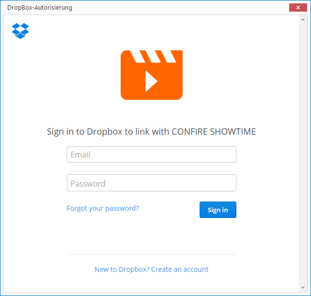
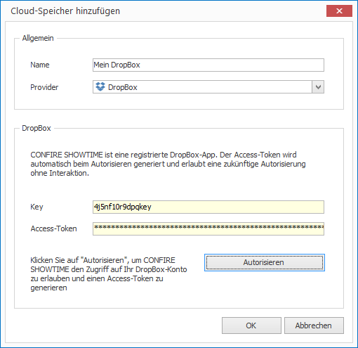
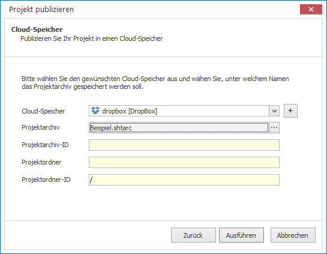

# Per DropBox publizieren

Um Projekte aus dem CONFIRE SHOWTIME DESIGNER heraus in einem DropBox-Ordner zu publizieren, müssen Sie zunächst einmalig den Zugriff auf DropBox konfigurieren:

1. Klicken Sie auf `Projekt > Publikationsziele verwalten > Cloud-Speicher`. Ein Dialogfenster öffnet sich.

2. Klicken Sie auf `Hinzufügen`.

3. Vergeben Sie einen Namen für Ihren neuen Publikationsort und wählen Sie unter `Provider` die Angabe `DropBox`.

4. Klicken Sie auf `Autorisieren`, um sich mit CONFIRE SHOWTIME an ein DropBox-Konto anzumelden. Es öffnet sich ein Dialogfenster.
   
   

5. Melden Sie sich nun an DropBox an, indem Sie E-Mail und Kennwort eingeben and dann mit `Sign in` bestätigen. War die Anmeldung erfolgreich, können Sie CONFIRE SHOWTIME den Zugriff auf Ihr DropBox-Konto erlauben.

6. DropBox generiert nun einen Zugriffsschlüssel (Access-Token), der zukünftig den sicheren Zugriff auf das DropBox ohne manuelles Anmelden erlaubt.
   
   

6. Klicken Sie auf `OK`. Der neue DropBox-Speicher taucht nun in der Liste der Cloud-Speicher auf.

7. Klicken Sie auf `Schließen`.

Jetzt können Sie publizieren:

1. Öffnen Sie das gewünschte Projekt.

2. Klicken Sie auf `Projekt > Publizieren`. Ein Assistent öffnet sich.

3. Wählen Sie als Publikationsziel `Cloud-Speicher` aus und klicken Sie auf `Weiter`.
   
   
   
4. Wählen Sie nun den zuvor definierten DropBox-Speicher aus. Möchten Sie den Namen oder den Unterordner des resultierenden Projektarchivs ändern, klicken Sie in `Projektarchiv` auf die Schaltfläche `...`.

5. Sind Sie mit Ihren Angaben zufrieden, klicken Sie auf `Ausführen`. 

CONFIRE SHOWTIME erstellt nun ein Projektarchiv und kopiert es nach DropBox. Sobald Sie Änderungen an Ihrem Projekt vorgenommen haben, publizieren Sie es erneut. CONFIRE SHOWTIME merkt sich die letzte Auswahl im Publikationsassistenten, so dass Sie mit nur wenigen Mausklicks diesen Vorgang jederzeit wiederholen können.

Weitere Details zum Publikationsstandort DropBox finden Sie im folgenden [Referenz-Kapitel](../../reference/publishing/dropbox.md).