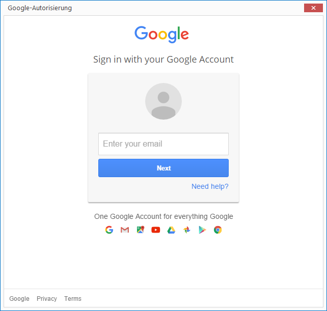
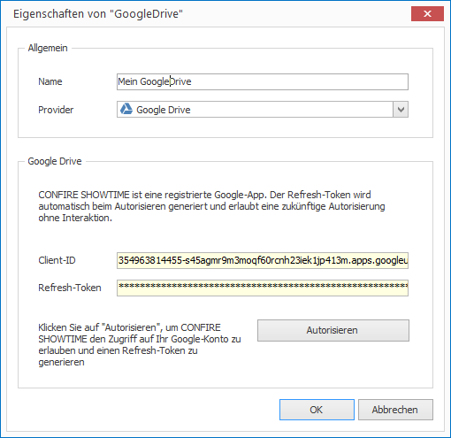

# Per Google Drive publizieren

Um Projekte aus dem CONFIRE SHOWTIME DESIGNER heraus in einem Google Drive-Ordner zu publizieren, müssen Sie zunächst einmalig den Zugriff auf Google Drive konfigurieren:

1. Klicken Sie auf `Projekt > Publikationsziele verwalten > Cloud-Speicher`. Ein Dialogfenster öffnet sich.

2. Klicken Sie auf `Hinzufügen`.

3. Vergeben Sie einen Namen für Ihren neuen Publikationsort und wählen Sie unter `Provider` die Angabe `Google Drive`.

4. Klicken Sie auf `Autorisieren`, um sich mit CONFIRE SHOWTIME an ein Google Drive-Konto anzumelden. Es öffnet sich ein Dialogfenster.
   
   

5. Melden Sie sich nun an Google Drive an, indem Sie Ihre E-Mail eingeben, auf `Next` klicken, danach  Ihr Kennwort eingeben and dann mit `Sign in` bestätigen. War die Anmeldung erfolgreich, können Sie CONFIRE SHOWTIME den Zugriff auf Ihr Google-Konto erlauben.

6. Google generiert nun einen Zugriffsschlüssel (Refresh-Token), der zukünftig den sicheren Zugriff auf das Google Drive ohne manuelles Anmelden erlaubt.
   
   

7. Klicken Sie auf `OK`. Der neue Google Drive-Speicher taucht nun in der Liste der Cloud-Speicher auf.

8. Klicken Sie auf `Schließen`.

Jetzt können Sie publizieren:

1. Öffnen Sie das gewünschte Projekt.

2. Klicken Sie auf `Projekt > Publizieren`. Ein Assistent öffnet sich.

3. Wählen Sie als Publikationsziel `Cloud-Speicher` aus und klicken Sie auf `Weiter`.
   
   
   
4. Wählen Sie nun den zuvor definierten Google Drive-Speicher aus. Möchten Sie den Namen oder den Unterordner des resultierenden Projektarchivs ändern, klicken Sie in `Projektarchiv` auf die Schaltfläche `...`.

5. Sind Sie mit Ihren Angaben zufrieden, klicken Sie auf `Ausführen`. 

CONFIRE SHOWTIME erstellt nun ein Projektarchiv und kopiert es nach Google Drive. Sobald Sie Änderungen an Ihrem Projekt vorgenommen haben, publizieren Sie es erneut. CONFIRE SHOWTIME merkt sich die letzte Auswahl im Publikationsassistenten, so dass Sie mit nur wenigen Mausklicks diesen Vorgang jederzeit wiederholen können.

Weitere Details zum Publikationsstandort Google Drive finden Sie im folgenden [Referenz-Kapitel](../../reference/publishing/googledrive.md).