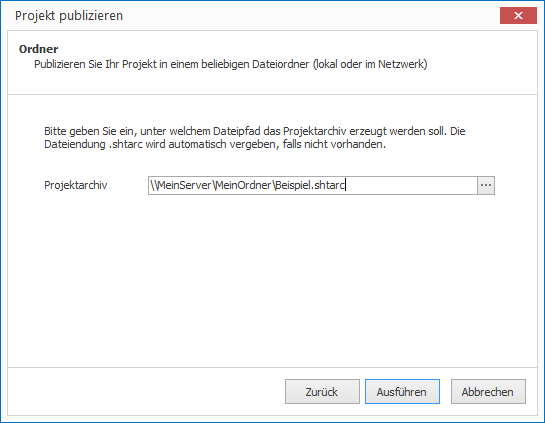

# Im lokalen Netzwerk publizieren

CONFIRE SHOWTIME DESIGNER kann Projekte direkt im lokalen Netzwerk publizieren:

1. Öffnen Sie das gewünschte Projekt.

2. Klicken Sie auf `Projekt > Publizieren`. Ein Assistent öffnet sich.

3. Wählen Sie als Publikationsziel `Ordner` aus und klicken Sie auf `Weiter`.

4. Legen Sie fest, unter welchem Namen das Projekt publiziert werden soll. Klicken Sie in `Projektarchiv` auf die Schaltfläche `...`, um bei Bedarf ein Dialogfenster zum Speichern von Dateien aufzurufen.
   
   
   
5. Sind Sie mit Ihren Angaben zufrieden, klicken Sie auf `Ausführen`. 

CONFIRE SHOWTIME erstellt nun ein Projektarchiv und kopiert es an den von Ihnen vorgegebenen Speicherort. Sobald Sie Änderungen an Ihrem Projekt vorgenommen haben, publizieren Sie es erneut. CONFIRE SHOWTIME merkt sich die letzte Auswahl im Publikationsassistenten, so dass Sie mit nur wenigen Mausklicks diesen Vorgang jederzeit wiederholen können.