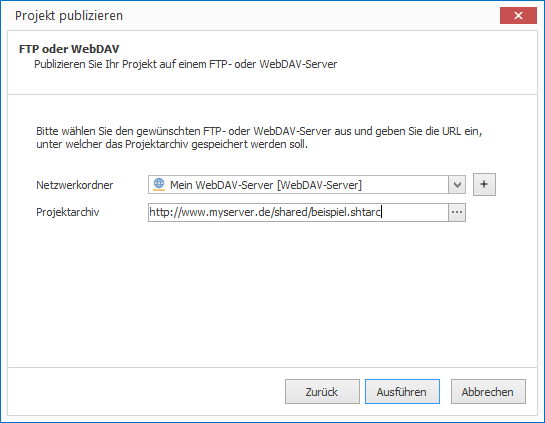

# Per WebDAV publizieren

Um Projekte aus dem CONFIRE SHOWTIME DESIGNER heraus in einem WebDAV-Ordner zu publizieren, müssen Sie zunächst einmalig den Zugriff auf einen WebDAV-Server definieren:

1. Klicken Sie auf `Projekt > Publikationsziele verwalten > FTP- und WebDAV-Server`. Ein Dialogfenster öffnet sich.

2. Klicken Sie auf `Hinzufügen`.

3. Vergeben Sie einen Namen für Ihren neuen Publikationsort und wählen Sie unter `Typ` die Angabe `Ordner auf einem WebDAV-Server`.

4. Geben Sie die notwendigen Daten zu Ihrem WebDAV-Server ein. 

5. Klicken Sie auf "WebDAV-Server überprüfen", um den Zugriff auf den WebDAV-Server zu testen.
   
   

6. War der Verbindungstest erfolgreich, klicken Sie auf `OK`. Der neuer WebDAV-Server taucht nun in der Liste der Server auf.

7. Klicken Sie auf `Schließen`.

Jetzt können Sie publizieren:

1. Öffnen Sie das gewünschte Projekt.

2. Klicken Sie auf `Projekt > Publizieren`. Ein Assistent öffnet sich.

3. Wählen Sie als Publikationsziel `FTP oder WebDAV` aus und klicken Sie auf `Weiter`.
   
   

4. Wählen Sie nun den zuvor definierten WebDAV-Ordner aus und klicken Sie auf `Ausführen`. 

CONFIRE SHOWTIME erstellt nun ein Projektarchiv und kopiert es in den WebDAV-Ordner. Sobald Sie Änderungen an Ihrem Projekt vorgenommen haben, publizieren Sie es erneut. CONFIRE SHOWTIME merkt sich die letzte Auswahl im Publikationsassistenten, so dass Sie mit nur wenigen Mausklicks diesen Vorgang jederzeit wiederholen können.

Weitere Details zum Publikationsstandort WebDAV finden Sie im folgenden [Referenz-Kapitel](../../reference/publishing/webdav.md).