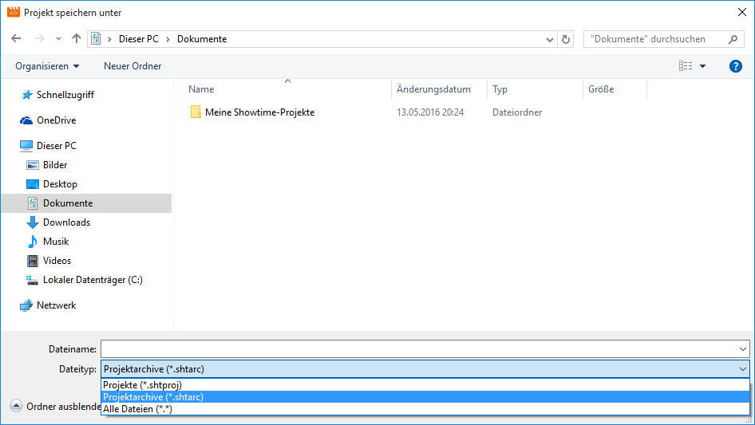

# Projektarchive erstellen

Projektarchive können Sie direkt aus dem CONFIRE SHOWTIME DESIGNER heraus erstellen. Gehen Sie wie folgt vor:

1. Starten Sie den CONFIRE SHOWTIME DESIGNER und öffnen Sie das gewünschte Projekt.

2. Klicken Sie auf `Projekt > Speichern unter`. Ein Dialogfenster zum Speichern von Dateien öffnet sich.

3. Wählen Sie als Dateityp `Projektarchive` aus. Projektarchive haben immer die Dateiendung `.shtarc`

4. Vergeben Sie einen Dateinamen und klicken Sie auf `Speichern`.

CONFIRE SHOWTIME erstellt nun ein neues Projektarchiv. Je nach Größe des Projektes kann dies ein wenig dauern. Ist das Projektarchiv erstellt, können Sie es kopieren, umbenennen oder als E-Mail versenden.

