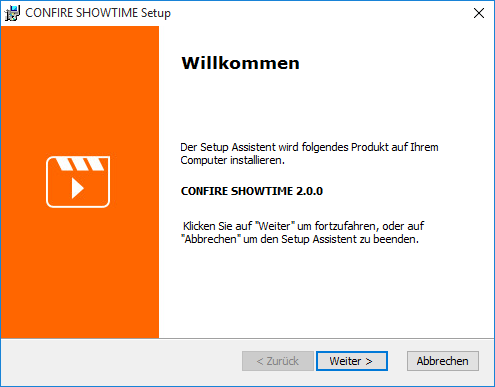
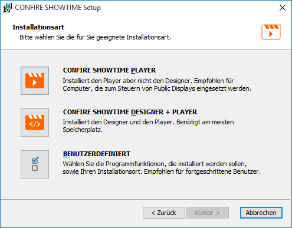
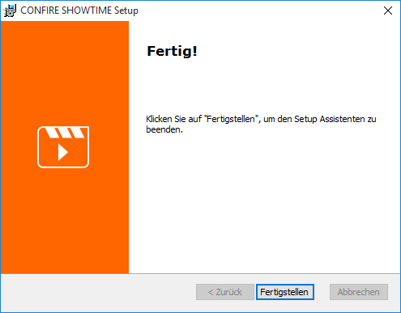

# Installation

Es gibt zwei unterschiedliche Installationspakete für CONFIRE SHOWTIME:

* `ConfireShowtime64.msi` ist ein Installationspaket für die 64-Bit-Versionen von Windows.
* `ConfireShowtime32.msi` ist ein Installationspaket für die 32-Bit-Versionen von Windows.

Sollten Sie sich unsicher sein, welches das Richtige ist, probieren Sie zunächst das Paket für die 64-Bit-Version von Windows aus. Sollte die Installation mit einem Hinweis auf fehlende Kompatibilität fehlschlagen, nehmen Sie das Paket für die 32-Bit-Version von Windows.

Sie können die 32-Bit-Version von CONFIRE SHOWTIME auch unter einer 64-Bit-Variante von Windows installieren. Sie können aber nicht die 32-Bit-Version und die 64-Bit-Version gleichzeitig installieren. Das jeweilige Setup erkennt dies automatisch und bricht die Installation mit einem Hinweis ab.

## Neuinstallation

So gehen Sie vor:

1. Öffnen Sie die Webseite http://showtime.stueber.de/download.php in Ihrem Webbrowser.

2. Klicken Sie auf die gewünschte Download-Schaltfläche. Ihr Webbrowser lädt das Installationspaket nun für Sie herunter.

3. Starten Sie die Installation, indem Sie das soeben heruntergeladene Installationspaket ausführen. Es erscheint folgender Dialog:
   
   

4. Klicken Sie weiter und wählen Sie die Installationsart aus:
   
   

   Sie haben hier 3 Möglichkeiten:
   
   * Wählen Sie `CONFIRE SHOWTIME PLAYER`, wenn Sie nur den Player aber nicht den Designer installieren möchten. 
   * Wählen Sie `CONFIRE SHOWTIME DESIGNER + PLAYER`, wenn Sie Designer und Player installieren möchten.
   * Wählen Sie `BENUTZERDEFINIERT`, wenn Sie noch feiner selektieren oder das Zielverzeichnis ändern möchten. So können Sie beispielsweise mit Hilfe dieser Option nur den Designer installieren.

5. Haben Sie sich für eine Installationsart entschieden, wählen Sie diese aus und folgen Sie den Anweisungen des Setup-Assistenten.

6. Eine erfolgreiche Installation wird mit folgendem Schlussdialog quittiert.
   
   

## Designer und Player starten

Nach erfolgreicher Installation finden Sie im Windows-Startmenü zwei neue Einträge:

* Zum Starten des CONFIRE SHOWTIME DESIGNER klicken Sie auf das Windows-Startmenü und dort unter `STÜBER SYSTEMS` auf die Applikation `CONFIRE SHOWTIME DESIGNER`.

* Zum Starten des CONFIRE SHOWTIME PLAYER klicken Sie auf das Windows-Startmenü und dort unter `STÜBER SYSTEMS` auf die Applikation `CONFIRE SHOWTIME PLAYER`.

## Aktualisierung {#Aktualisierung}

Für eine Aktualisierung nutzen Sie das gleiche Installationspaket, das Sie auch für eine Neuinstallation nutzen würden. Das Installationspaket erkennt automatisch, ob es sich um eine Neuinstallation oder ein Update handelt.

So gehen Sie vor:

1. Öffnen Sie die Webseite http://showtime.stueber.de/download.php in Ihrem Webbrowser.

2. Klicken Sie auf die gewünschte Download-Schaltfläche. Ihr Webbrowser lädt das Installationspaket nun für Sie herunter.

3. Starten Sie das Update, indem Sie das soeben heruntergeladene Installationspaket ausführen, und folgen Sie den Anweisungen. Es müssen keine Optionen ausgewählt werden.

4. Ein erfolgreiches Update wird wie gewohnt mit folgendem Schlussdialog quittiert.
   
   
   
> #### primary::Hinweis
> 
> Optional können Sie im CONFIRE SHOWTIME DESIGNER oder im CONFIRE SHOWTIME PLAYER auf `Extras > Auf Aktualisierung prüfen` klicken. Liegt eine neue Version vor, wird Ihnen dies angezeigt und Sie bekommen die Möglichkeit das Installationspaket per Knopfdruck herunterzuladen und direkt auszuführen.

## Deinstallation

So gehen Sie vor:

1. Öffnen Sie die Windows-Systemsteuerung.

2. Klicken Sie auf `Programme und Features`. Es dauert oft ein wenig, bis alle installierten Programme aufgelistet sind.

3. Wählen Sie den Eintrag `CONFIRE SHOWTIME` und klicken Sie auf die Schaltfläche `Deinstallieren`.

4. Folgen Sie den weiteren Anweisungen.

