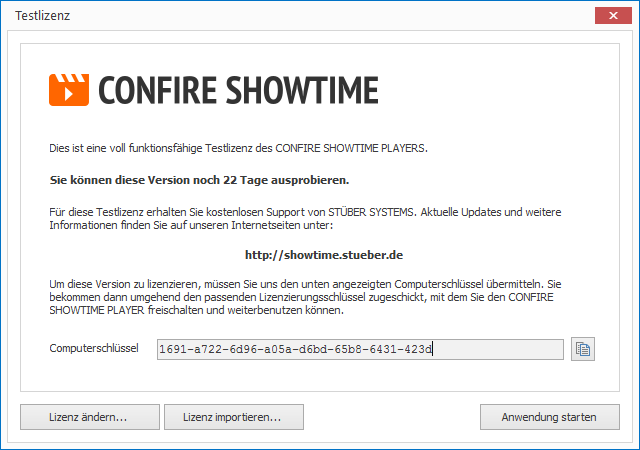
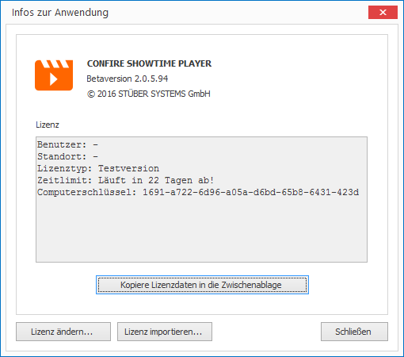

# Lizenzierung

Die Lizenzierung von CONFIRE SHOWTIME ist wie folgt geregelt:

* Der CONFIRE SHOWTIME Designer besitzt eine freie Lizenz. Er kann beliebig oft installiert und ohne Einschränkung genutzt werden.

* Der CONFIRE SHOWTIME Player muss für jede Installation lizenziert werden. Die Lizenz ist also an den Computer gebunden.

## Den Player lizenzieren

Beim Start eines nicht-lizenzierten Players wird Ihnen zunächst ein Hinweis angezeigt, der Sie darüber informiert, wie lange Sie die Demoversion noch nutzen können. Außerdem wird Ihnen der generierte Computerschlüssel des Players angezeigt. Dieser Computerschlüssel ist wichtig für den weiteren Lizenzierungsprozess:

1. Kopieren Sie den Computerschlüssel in die Windows-Zwischenablage, in dem Sie auf die kleine Schaltfläche neben der Anzeige klicken.

2. Fordern Sie Ihre Lizenz an, indem Sie eine E-Mail an `license@stueber.de` schreiben und den  Computerschlüssel dort einfügen. Wir erstellen dann umgehend eine neue Lizenz für Sie und schicken diese per E-Mail an Sie zurück.

3. Der Anhang dieser E-Mail enthält eine kleine XML-Datei, die Sie über die Schaltfläche `Lizenz importieren` einspielen können. Über die Schaltfläche `Lizenz ändern` können Sie die Lizenzdaten auch manuell eingeben.

## Die Lizenz des Players überprüfen

Gehen Sie wie folgt vor:

* Klicken Sie auf `UMGEBUNG`, dann auf `Infos zur Anwendung` und dann auf `Version und Lizenz`. Es öffnet sich ein Dialogfenster.

Es wird Ihnen die aktuelle Lizenz mit allen Details angezeigt. Mit Hilfe der Schaltflächen `Lizenz importieren` oder `Lizenz ändern` können Sie die Lizenz jederzeit ändern.

